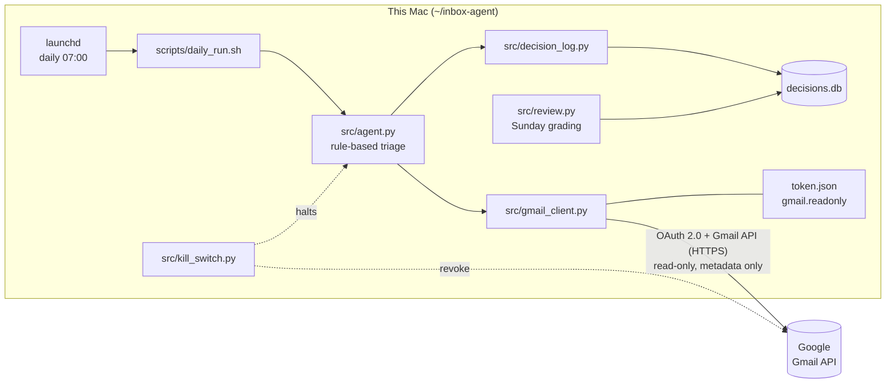
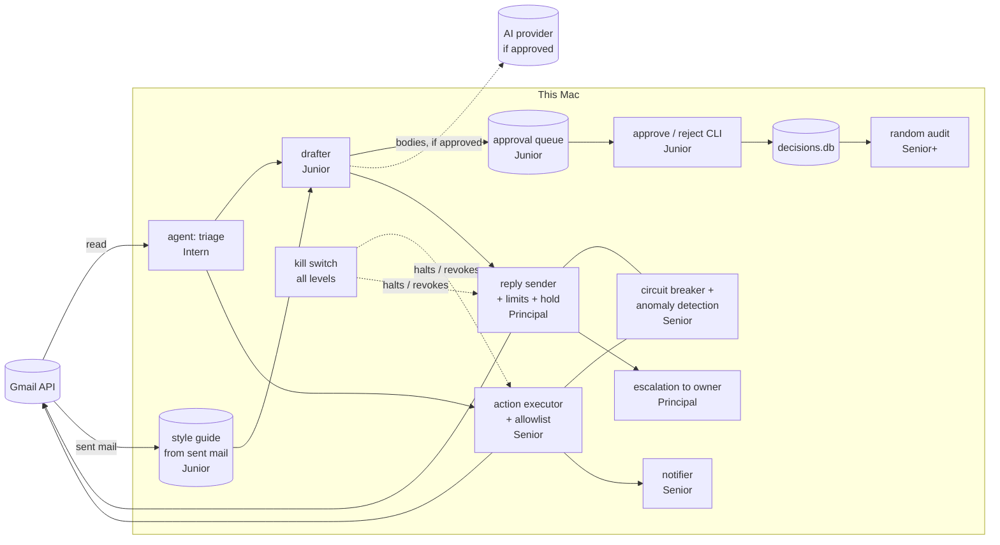

# Architecture

Current level: **Intern (read-only)**. See `governance/maturity-status.md`.

## Overview

The agent is a small Python program that runs **on this Mac only**. Once a day it reads inbox *metadata* from Gmail, triages each message with fixed rules, and writes its decisions to a local SQLite database. It makes no changes to Gmail, and email content goes nowhere except back to this machine from Google.

## Google API connection

| Item | Detail |
|---|---|
| OAuth client | Google Cloud "Desktop app" client (`installed` type), stored in `credentials.json` (git-ignored) |
| Sign-in flow | Browser sign-in with a loopback redirect to `localhost` and PKCE. Only happens interactively; unattended runs stop with `AuthRequired` instead of opening a browser. |
| Scope | `https://www.googleapis.com/auth/gmail.readonly`, **and nothing else** |
| Scope enforcement | `gmail_client.py` refuses any saved or newly granted token whose scopes aren't exactly `gmail.readonly` |
| Token storage | `token.json` (git-ignored, file mode `600`). It holds a refresh token, so treat it like a password. |
| Token lifetime | While the OAuth app is in Google's "Testing" mode, refresh tokens expire after 7 days, which means signing in again about weekly |
| Revocation | `kill_switch.py` posts the token to `https://oauth2.googleapis.com/revoke` and deletes `token.json`. Manual fallback: https://myaccount.google.com/permissions |

**Gmail API calls used.** This is the complete list; all are reads.

| Call | Purpose |
|---|---|
| `users.getProfile` | The account's email address, to tell whether the owner is in a message's `To:` |
| `users.messages.list` (`labelIds=INBOX`, optional `q=after:<time>`) | IDs of inbox messages to triage |
| `users.messages.get` (`format=metadata`) | Headers for one message: `From`, `To`, `Cc`, `Subject`, `Date`, `List-Unsubscribe`, `Precedence`, `Auto-Submitted`, plus Gmail labels |

Message bodies are **never requested**. Gmail also returns a `snippet` (the start of the body) even in metadata responses; `gmail_client.py` discards it along with all other fields not on the whitelist above.

## Gmail permission ladder

The Gmail permission **grows as the agent matures** and shrinks on demotion. It's the main technical control behind each level. It changes **only** at a promotion or demotion signed off in `governance/decision-log.md`, never mid-level.

| Level | `SCOPES` in `src/gmail_client.py` | What it adds | Notes |
|---|---|---|---|
| Intern (now) | `gmail.readonly` | Read mail | Metadata only by code choice; the permission itself would allow bodies |
| Junior | `gmail.readonly` (unchanged) | Nothing in Gmail | Reading bodies for drafting, and the owner's sent replies for the style guide, are within `readonly` |
| Senior | `gmail.modify` (replaces `readonly`) | Change labels, archive, trash, **and send** | Broader than Senior's role: Google has no narrower permission for labeling or archiving, so the code allowlist confines it (see `docs/scope.md`, Senior) |
| Principal | `gmail.modify` + `gmail.send` | Explicit send | `gmail.modify` already permits sending; `gmail.send` is added so the consent screen and token state send access openly |

**How a permission change is made** (promotion or demotion):
1. The Gate 5 sign-off (or the demotion entry) names the new permission set.
2. Update the OAuth consent screen's scope list in Google Cloud Console to match.
3. Change `SCOPES` in `src/gmail_client.py`. The scope check requires an **exact match**, so the old token is refused automatically from this point.
4. Revoke the old grant: run `src/kill_switch.py` (on demotion, do this **first**), confirm at https://myaccount.google.com/permissions, then delete `.killed`.
5. Sign in again in a terminal (`.venv/bin/python src/agent.py`). The Google consent screen must list exactly the new permissions.
6. Verify the `scopes` in `token.json`, then record the change in `decision-log.md` and `maturity-status.md`, and update this document, `docs/scope.md` and `docs/atf-conformance.md` in the same commit.

## Claude / Anthropic

**No runtime connection.** The agent does not call Claude or any Anthropic API, and no email data is sent to Anthropic by the agent. Triage is fixed rules in `src/agent.py`.

**Development only.** The code was written with Claude Code in an interactive session. During that session Claude Code ran the agent, saw run summaries (message counts per triage bucket), and checked the token's scope. It did not read `token.json`'s secrets or any real subject lines from `decisions.db`. This project doesn't use the claude.ai Gmail connector.

**Planned, not built (Junior).** Drafting replies will likely use the Claude API, which would send the body of `needs_response` emails to Anthropic. That's a new data flow. It gets decided and documented here, and tested under Gate 2 (prompt injection), before it's built. See *Planned architecture by level*.

## Components

| File | Role |
|---|---|
| `src/gmail_client.py` | OAuth and read-only Gmail access; metadata whitelist; one Gmail connection per run, closed at exit |
| `src/agent.py` | Lists new inbox messages and triages each as `needs_response`, `junk` or `fyi` (classifier v2); tags SENSITIVE subjects |
| `src/decision_log.py` | The only writer to `decisions.db`; enforces the no-body rule |
| `src/review.py` | Weekly grading of triage calls and the `--summary` report for `governance/metrics.md` |
| `src/kill_switch.py` | Blocks restarts (`.killed`), halts a running agent, revokes the token, logs the event. Standard library only. |
| `scripts/daily_run.sh` + `scripts/com.inboxagent.daily.plist` | launchd job: daily at 07:00 (or on wake), logs to `logs/agent.log`, macOS notification on failure |

## Data storage (all local, all git-ignored)

| Store | Contents |
|---|---|
| `decisions.db` → `decisions` | One row per action, using the plan's schema. `target` is the subject only (≤200 characters); `reasoning` and `outcome` are capped at 500 characters. Run start/end and kill-switch rows are included. |
| `decisions.db` → `seen_messages` | SHA-256 hash of each triaged Gmail message ID, so nothing is triaged twice |
| `decisions.db` → `reviews` | The owner's grades: predicted vs actual bucket |
| `token.json` | OAuth tokens (mode `600`) |
| `logs/agent.log` | Output of scheduled runs: counts and errors, no subjects |
| `agent.pid`, `.killed` | Runtime state for the kill switch |

`decisions.db` is mode `600`. Nothing listed here is committed; secrets were checked for before every commit.

## Runtime

Runs locally on macOS, scheduled daily by launchd (`scripts/`), in a Python virtual environment with pinned dependencies (`requirements.txt`).

## Planned architecture by level

Everything above describes Intern, as built. This section is the **planned** shape of later levels. It's a design intent, not approval: each level's design is finalized in its promotion sign-off, and this document is rewritten to match **as built** in the same commit (Gate 5, "documentation updated").

| Level | New components | New data flows | New controls |
|---|---|---|---|
| **Junior** | Body fetch for `needs_response` mail only; **style-guide builder** reading the owner's sent replies (last 90 days, SENSITIVE excluded) into a versioned, owner-approved style guide with no quoted text; **drafter**; local **approval queue** (git-ignored, owner-only, entries deleted once decided); **approve/reject CLI** writing `accepted` in `decisions.db` | Bodies and sent replies Google → Mac. If an AI model drafts or builds the style guide: that text Mac → provider (e.g. Anthropic), with the API key in the git-ignored `.env` | Prompt-injection tests; bodies never logged; queue retention; style guide reviewed and versioned (a change triggers a review); drafts compared with the replies the owner actually sent; SENSITIVE mail flagged, not drafted, unless sign-off says otherwise |
| **Senior** | **Action executor** that can make only the Gmail calls on the approved list; **notifier** (after each action or daily digest); **circuit breaker** (halts after repeated failures); **anomaly detection** against a behavioral baseline | Writes Mac → Gmail. If unsubscribing is approved: one-click web requests to senders, or unsubscribe emails | Allowlist enforced in code and tested against `gmail.modify`'s wider powers; every action logged; kill switch halts the executor; **weekly random audit** sampler in `review.py` (`governance/ongoing-validation.md`) |
| **Principal** | **Reply sender** with a recipient check (thread participants only), daily cap, optional hold-and-cancel window and a SENSITIVE hard block; **escalation** path to the owner for edge cases | Outbound email to third parties | Adversarial tests aimed at sending; full audit of the Senior period; random audit extended to sent replies, plus every escalation; a hard block on SENSITIVE replies in the sender itself, in addition to triage |
